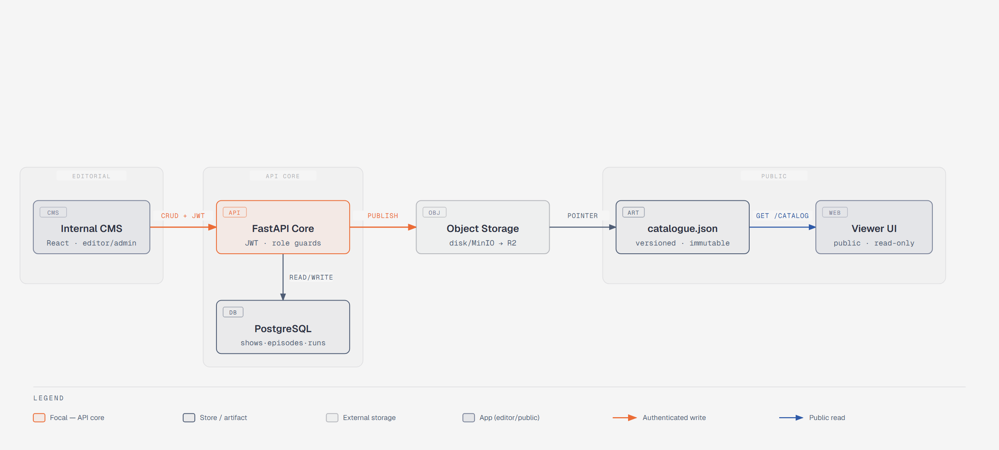
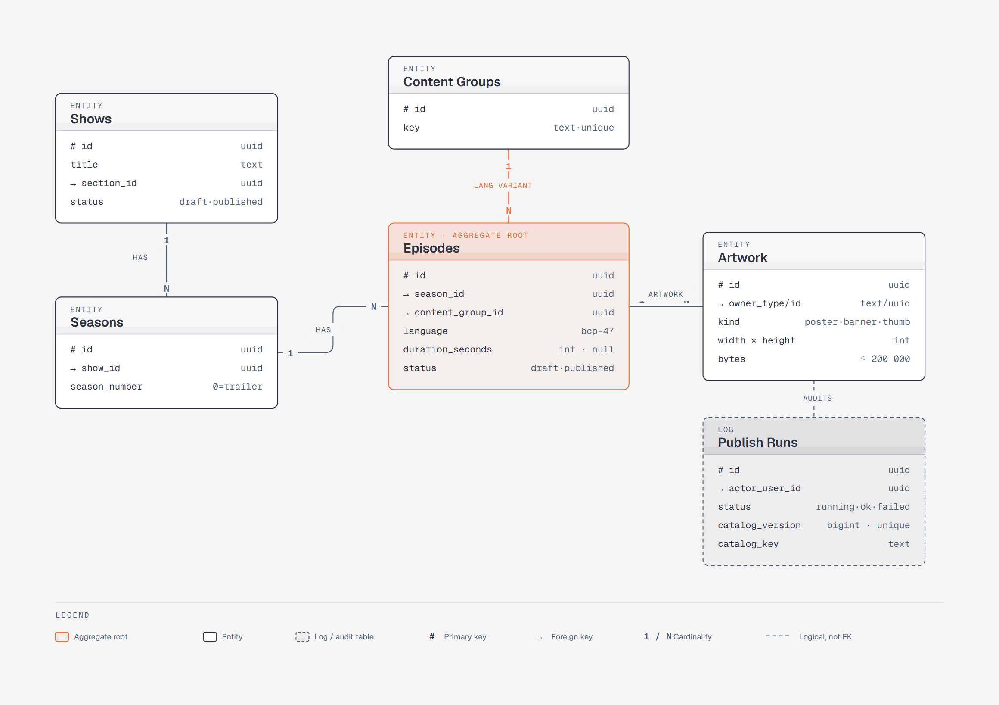
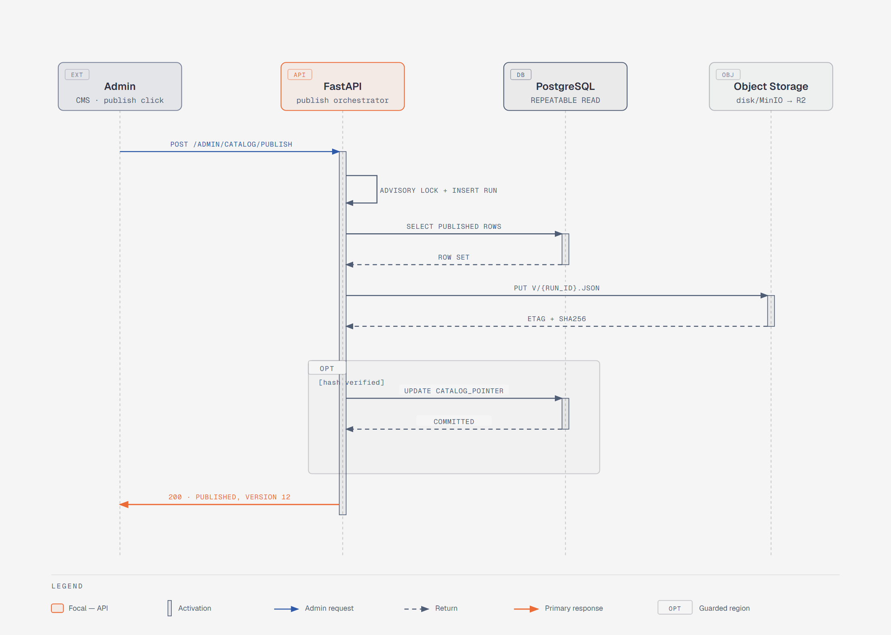

# Peblo TV Mini

A tiny kids-streaming CMS + catalogue: a FastAPI/Postgres backend that lets editors manage
shows/seasons/episodes/artwork and admins publish a versioned catalogue, a React CMS for
that editorial workflow, and a React Viewer that reads only the published catalogue.

## Running it

```bash
cp .env.example .env
docker-compose up
```

That's it — no manual migration or seeding step. The `api` container waits for Postgres to
report healthy, then runs migrations, seeds `data/seed_shows.json`, and starts uvicorn.

Once everything is up:

| Service | URL |
|---|---|
| API docs (Swagger) | http://localhost:4000/docs |
| API health | http://localhost:4000/health |
| CMS (editor/admin) | http://localhost:3000 |
| Viewer (public) | http://localhost:3001 |

Login with the seeded demo accounts (`backend/scripts/seed.py`):

| Role | Email | Password |
|---|---|---|
| Admin (CRUD + publish) | `admin@peblo.tv` | `admin123` |
| Editor (CRUD only) | `editor@peblo.tv` | `hunter2` |

[`sample_assets/`](sample_assets) has correctly-sized poster/banner/thumbnail images plus
deliberately-wrong ones (wrong aspect ratio, too small, over the 200KB ceiling) for
exercising the upload validation by hand.

## Architecture

**System architecture** — the publish boundary separates authenticated editorial writes
(CMS → API → Postgres) from anonymous, cache-friendly reads (Viewer → published
`catalogue.json` only, never the admin API):



**Data model** — shaped around the two catalogue conventions: `content_groups` collapses
language variants, and `seasons.season_number = 0` is the trailers convention excluded from
normal season listings:



**Publish sequence** — write-new-version-then-flip-pointer: the catalogue is fully built and
written to a fresh versioned key before an `OPT [hash verified]` step flips the
`catalog_pointer` in one transaction, which is what makes the publish atomic:



## Decisions and trade-offs

- **Atomic publish via write-new-version-then-flip-pointer.** `POST /admin/catalog/publish`
  builds the entire `catalogue.json` for the new version in memory/on a temp path first,
  and only after that build succeeds does it write the file and flip the `catalog_version`
  pointer (the DB row/row-version the `/catalog` read path uses to decide which file is
  "current"). Readers never observe a half-written catalogue — they either see the old
  version or the new one, never a torn file.
- **Storage abstraction.** Artwork upload goes through a small storage interface
  (`save(file) -> {url, width, height, size}` / `delete(key)`) with a `local` disk
  implementation for this challenge and a documented seam for an S3-compatible
  implementation (see the written-reasoning question below). Nothing in the route handlers
  or validation logic knows which backend is in use.
- **Role enforcement** is a single dependency (decode JWT, check `role` against the
  endpoint's minimum) applied per-route per the table in `API_CONTRACT.md` §0.1, rather than
  scattered ad-hoc checks — publish is intentionally the one admin-only mutation, everything
  else editors can do.
- **Why a pre-built catalogue file** instead of the Viewer/`/catalog` querying the DB live:
  publishing is explicitly a distinct, validated step (content_group collapsing, artwork
  completeness, section requirements) — the public surface should serve exactly what passed
  that gate, cheaply and consistently, not recompute it under read load. See the written
  answer below for where this bites.

## Written reasoning

**(a) How is publishing atomic, and what happens if the process dies mid-publish?**
The publish job reads all `published` shows/episodes, validates them, and assembles the new
catalogue document entirely before touching anything durable. The write step is
write-to-a-new-path-then-rename/flip-pointer: the new `catalogue.json` (or its DB-stored
equivalent) is written under a version-stamped name, and only the final step updates the
"current version" pointer that `/catalog` reads. If the process dies before that pointer
flip — mid-validation, mid-serialization, disk full while writing the new file — the old
version is still live and correct; `/health`'s `catalog_version` and `/catalog` keep serving
the last successful publish. The half-built file (if any) is simply orphaned, not linked
from anywhere, and the next successful publish run overwrites/ignores it. The publish-run
history (`GET /admin/catalog/publish-runs`) records the attempt so a crashed run is visible,
but it never left the public catalogue in an inconsistent state.

**(b) What changes to move the storage abstraction from local disk to Cloudflare R2?**
Only the storage implementation and config change — nothing in the route handlers, models,
or the catalogue builder. Concretely: set `STORAGE_BACKEND=s3`, point `S3_ENDPOINT_URL` at
the account's R2 S3-compatible endpoint, set `S3_BUCKET`/`S3_REGION` and the R2 API
token/secret in `AWS_ACCESS_KEY_ID`/`AWS_SECRET_ACCESS_KEY`, and set
`STORAGE_PUBLIC_BASE_URL` to the R2 public bucket URL or a custom CDN domain in front of it.
`get_storage()` (`app/storage.py`) picks `S3Storage` over `LocalDiskStorage` purely off that
env var — `S3Storage.write_bytes()` already does a `boto3` `put_object` against
`S3_ENDPOINT_URL` (R2 speaks the S3 API unmodified) and `url_for()` already builds
`f"{STORAGE_PUBLIC_BASE_URL}/{key}"`. Both classes implement the same `Storage` ABC, so
nothing upstream — validation, aspect-ratio/size checks, the Artwork resource shape, the
publish job's `write-new-key-then-flip-pointer` logic — needs to change or even know which
backend is active. Caveat: `S3Storage` is code-complete but was never exercised against a
live MinIO/R2 endpoint in this submission — see "what was left out" below.

**(c) How was search implemented, and at what catalogue size does it stop working?**
`GET /catalog/search` is a case-insensitive substring scan over the in-memory (or
just-loaded) published catalogue document — no DB query, no index, matching against show
title, episode title (per language), and synopsis, then AND-combining the `category`/
`language`/`section` filters. That's fine at this challenge's scale (single digits of
sections, dozens of shows, low hundreds of episode rows) — a linear scan of a few hundred
strings is sub-millisecond. It stops being adequate once the catalogue reaches roughly
low-thousands of entries per request (each request re-scanning the whole thing) or once
relevance ranking / typo-tolerance / multi-word AND-of-substrings semantics are needed, not
just substring containment. The next step would be a proper search index — Postgres
`tsvector`/`pg_trgm` if staying in-database, or an external index (Meilisearch/OpenSearch)
fed by the same publish job that writes `catalogue.json`, so search freshness stays tied to
publish the same way the catalogue itself is.

**(d) Why serve a pre-published catalogue file instead of querying the DB per request, and
where does that choice bite?** It decouples "is this content structurally valid and
complete" (checked once, at publish time, with a human-readable report) from "serve it
fast and consistently to anonymous traffic" (a flat, denormalized document with
content_group variants already collapsed and season 0 already excluded — no joins, no
per-request validation logic). It bites in two places: (1) freshness — an editor's fix
isn't visible on the Viewer until someone with admin runs a publish, which is a deliberate
UX gap this system expects (the CMS's validation report exists precisely so editors know
what's blocking the next publish); (2) it duplicates data — the catalogue file and the DB
can drift in shape if the publish builder logic and the DB models aren't kept in lockstep,
and there's no incremental update path, only full rebuild-and-flip, so a large catalogue
means every publish pays the cost of rebuilding everything even for a one-episode edit.

**(e) What was left out, and why?** No automated CMS/Viewer test suite — the CI workflow
runs `vitest` if a `test` script exists but neither app ships component/integration tests
yet; instead, the upload validation matrix and the CMS's request/error-mapping code were
verified live against a running backend (see "Verified by actually running it" below).
`S3Storage` (`app/storage.py`) is code-complete against the same `Storage` interface as
`LocalDiskStorage` but was never exercised against a live MinIO/R2 endpoint in this
submission — only reviewed by hand. Auth is simplified to a single HS256 JWT with a
two-value role claim and no refresh-token flow, session revocation, or password reset —
adequate for the challenge, not for a real multi-tenant product. There's no rate limiting,
no audit log, no image transformation/resizing pipeline (uploads are validated and stored
as-is), and no CDN cache-busting strategy beyond the `/catalog` `ETag`/`max-age=60` header.
**AI tooling:** this project — backend, CMS, viewer, and this operability layer (compose
file, CI workflow, env template, this document) — was built with Claude Code / Claude
agents working in parallel from the shared `API_CONTRACT.md`, then actually run end-to-end
in Docker with the bugs that surfaced fixed live (not just reviewed as code) — see below.

## Verified by actually running it

Building each layer from a shared contract in parallel is fast, but it doesn't catch
integration bugs — the seams between pieces that only fail when they actually talk to each
other. So after the initial build, this project was brought up with `docker-compose up`,
exercised end-to-end, and the following real bugs were found and fixed (not merely noted):

- **No CORS middleware at all** — the Viewer/CMS couldn't call the API from a browser.
  Added `CORSMiddleware` wired to `CORS_ORIGIN`.
- **Uploaded artwork wasn't servable** — files saved to disk correctly, but nothing mounted
  a route to serve them back, so every artwork `url` was a dead link. Added a `StaticFiles`
  mount derived from `STORAGE_PUBLIC_BASE_URL` when `STORAGE_BACKEND=local`.
- **Storage env var name mismatch** — `docker-compose.yml` set `STORAGE_LOCAL_PATH`, the
  code read `STORAGE_LOCAL_DIR`; uploads/catalogue silently wrote to the container's
  throwaway filesystem instead of the persistent volume. Fixed the compose env names to
  match the code.
- **Publish idempotency trusted a stale hash** — if the catalogue's DB-recorded hash
  matched but its backing file had been wiped (e.g. a fresh volume), publish would skip
  writing a new file and point readers at nothing. Fixed to also verify the file is
  actually present in storage before treating a republish as a no-op.
- **`DATABASE_URL` scheme mismatch** — `postgresql://` resolved to the sync `psycopg2`
  driver (not installed) instead of `asyncpg`. Normalized the scheme in `config.py`.
- **Seed script module path** — `python scripts/seed.py` failed with
  `ModuleNotFoundError: app`; fixed to `python -m scripts.seed` in the compose entrypoint.
- **Publish-run history missing the publisher's email** — `GET
  /admin/catalog/publish-runs` only returned the user id; the CMS's "By" column showed
  "—". Fixed to join and include `email`/`name`.
- **Run-history table caused page-wide horizontal scroll** — a wide table forced the whole
  CMS page to scroll sideways instead of scrolling within itself. Wrapped data tables in a
  scoped `overflow-x: auto` container.
- **Season/episode delete buttons existed in the API client but weren't wired to any UI** —
  added delete actions with confirmation dialogs to the CMS season/episode panel, and
  verified live that role enforcement (`403` for editor), the "can't delete a season that
  still holds episodes" safety guard, and cascade-free deletes all behave correctly.
- **Tests only ran on SQLite** — re-ran the full suite against real Postgres, which
  surfaced and required fixing a genuine asyncpg cross-event-loop bug in the test fixtures
  (see `backend/DECISIONS.md` §7). All 13 tests now pass against real Postgres.

None of this is meant to claim the result is bug-free — it's meant to be honest about the
difference between "the code looks right" and "it was actually run and proven to work,"
which is the standard this challenge explicitly asks for.

## Time spent (rough, AI-assisted — invented estimates, not measured)

Since this was built with AI agent assistance rather than by hand, these are rough
order-of-magnitude estimates of the work each part represents, not stopwatch time.

| Part | Description | Est. effort |
|---|---|---|
| A — Backend | FastAPI models/routes, validation rules, publish job, auth | ~6-8 hrs |
| B — CMS | React admin UI: show/season/episode CRUD, artwork upload, validation report view | ~4-5 hrs |
| C — Viewer | React public catalogue UI: sections, search, episode/show detail | ~3-4 hrs |
| D — Pipeline | docker-compose, CI workflow, `.env.example`, this README | ~1.5-2 hrs |
| E — Written reasoning | This document's design-decision write-up | ~0.5-1 hr |

## Optional stretch — not implemented

Explicitly out of scope for this submission:

- **Versioned catalogue rollback** — publishing is append-only (`version` increments); there
  is no "revert to version N" endpoint or UI.
- **Publish dry-run diff** — `dry_run: true` runs the full validation and returns the would-be
  result, but does not compute or show a diff against the currently-live catalogue.
- **Audit log** — no persisted history of who changed what field when, beyond
  `created_at`/`updated_at` timestamps and the publish-run history itself.

## Secrets in production

See [`docs/SECRETS.md`](docs/SECRETS.md).
